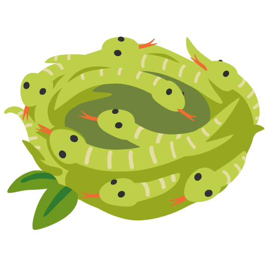

# hugg

> for slow reading book huggers

## anatomy

| | name | description | framework |
--- | --- | --- | ---
 | **[flugg](/flugg)** | client app | Flutter
 | **[nugg](/nugg)** | API service | .NET